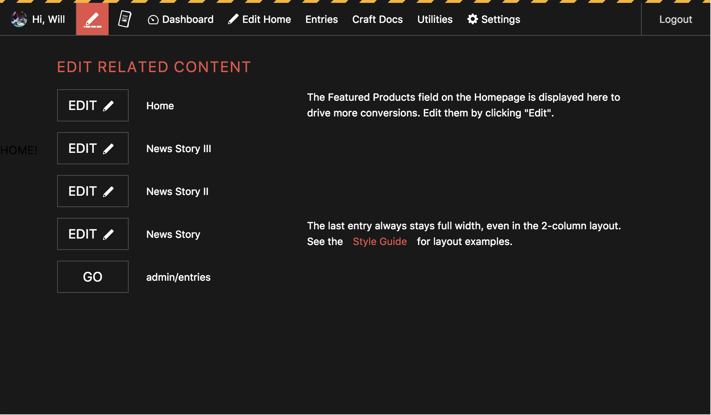
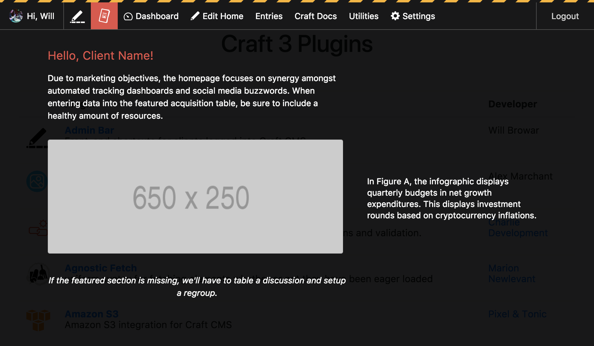
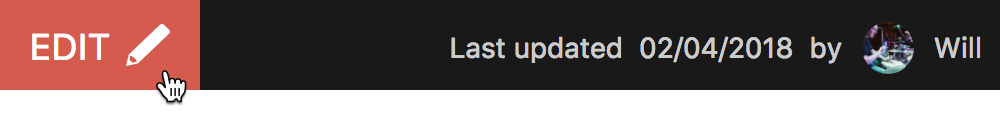
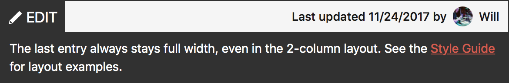
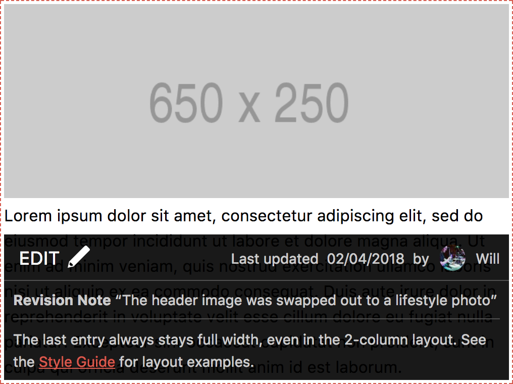

# Craft – Admin Bar
Front-end shortcuts for clients logged into [Craft CMS](https://craftcms.com).

> _UPGRADE NOTE: if you're upgrading from Craft 2, or updating in Craft 3, please update your Twig templates to use `{{ adminbar() }}` and `{{ editlink() }}` tags, as described below. The old `` hook and `{{ craft.adminbar.bar() }}` template tags have been removed in Craft 3._

## Requirements
* Craft 3.0 RC1+
* PHP 7.0+
* Browsers that support the [current CSS Grid Layout spec](https://caniuse.com/#feat=css-grid)

## Installation
1. Open your terminal and go to your Craft project:

`cd /path/to/project`

2. Then tell Composer to require the plugin:

`composer require wbrowar/adminbar`

3. In the Control Panel, go to Settings → Plugins and click the “Install” button for Admin Bar.

---

# Admin Bar


## Add the Default Admin Bar
To add Admin Bar to your website add the `{{ adminbar() }}` tag anywhere within your page template. Admin Bar will appear at the top of any page that includes this tag when someone—who has the permission to view the CP—is logged into your website.

Because Admin Bar is HTML, CSS, and Javascript added to your website's front-end, you may need to make some slight adjustments to override Admin Bar's CSS to make it fit your website.

You may pass in an array of arguments to make some changes on how Admin Bar looks and functions. In this example, you may pass in the entry that you'd like to appear when someone clicks the "Edit" link.

```twig
{{ adminbar({ entry: entry }) }}
```

Here is a list of available arguments:

| Argument | Default | Description |
| --- | --- | --- |
| `category` | *null* | Pass in a category object to add an edit link for that category |
| `entry` | *null* | Pass in an entry object to add an edit link for that entry |
| `sticky` | *true* | Uses css to `position: fixed;` Admin Bar to the top of the page |
| `useCss` | *true* | Add the default styles to Admin Bar or leave them off and style it your way |
| `useJs` | *true* | Use the Admin Bar's default Javascript |

## Adding Admin Bar to the Front-End via Javascript
Admin Bar can be added to many sites that use Craft as a headless CMS or use static caching, like FastCGI Caching. This requires these three steps:

1. Admin Bar assets get included onto the page, via the `{{ getAdminBarAssets({ uri: craft.app.request.url }) }}` Twig tag
2. An HTTP client—like jQuery or Axios—is used to get Admin Bar's HTML and place it onto the page
3. The Javascript function, `window.adminBarInit();`, gets called

The `{{ getAdminBarAssets({ uri: craft.app.request.url }) }}` Twig tag places all of Admin Bar's CSS and Javascript onto the page within `<script>` and `<style>` tags. This should be placed towards the bottom of the `<body>` tag.

With the assets in place, you can use `jQuery.ajax()`, `axios.post()`, or other similar methods to request Admin Bar's HTML from Craft. This requires the URI of the page be passed in to the request to give Admin Bar context.

Here's an example of using jQuery to get Admin Bar's HTML:

```javascript
import jQuery from 'jquery';

// get the URI from the current page
const data = {
	uri: window.location.pathname
}

// request Admin Bar after converting array to JSON
jQuery.ajax({
    type: 'POST',
    url: '/actions/admin-bar/bar',
    cache: false,
    data: JSON.stringify(data),
    dataType: 'json',
    success: function(data) {
        if (data.response === 'success' && typeof adminBarInit === "function") {
            // add Admin Bar to the bottom of the <body> element
            jQuery('body').append(data.content);

            // fire init function that gets loaded into the template
            // via the {{ getAdminBarAssets({ uri: craft.app.request.url }) }} Twig tag
            adminBarInit();
        }
    },
    error: function(err) {
        console.log("Error");
        console.log(err);
    }
});
```

Note that `JSON.stringify()` is used to convert the data over to JSON before sending.

Here's another example, using a Single File Vue Component that uses Axios for HTTP request:
```vue
<template>
    <div v-html="adminbar"></div>
</template>

<script>
    import axios from 'axios';

    export default {
        data() {
            return {
                adminbar: false,
                data: false,
            };
        },
        props: {
            uri: { required: true },
        },
        mounted() {
            // get the URI that's passed in as a prop
            this.data = {
                uri: this.uri
            };

            // make request to get Admin Bar content
            axios.post('/actions/admin-bar/bar', this.data).then((json) => {
                if (json.status === 200) {
                    this.adminbar = json.data.content;
                }
            });
        },
        updated: function () {
            this.$nextTick(function () {
                if (this.adminbar && typeof window.adminBarInit === "function") {
                    // fire init function that gets loaded into the template
                    // via the {{ getAdminBarAssets() }} Twig tag
                    window.adminBarInit();
                }
            })
        }
    }
</script>
```

If this file is `AdminBar.vue`, the Twig code for this Vue Component would be: `<admin-bar uri="{{ craft.app.request.url }}"></admin-bar>`.

This component can be copied from this repo's [resources/scripts folder](resources/scripts/AdminBar.vue).

> _If you have any suggestions on how to make sure security with this feature is tight, please let me know._

---

## Admin Bar Widgets





Craft plugins can add context-aware information to Admin Bar. To enable Admin Bar Widgets for your site, use Admin Bar plugin settings.

> NOTE: This feature is new and in beta. If you have any feedback or suggestion for more widget layouts, please create a [GitHub Issue](https://github.com/wbrowar/craft-3-adminbar/issues).

Plugins that provide Admin Bar Widgets:
- [Admin Bar](https://github.com/wbrowar/craft-3-adminbar)
- [Guide](https://github.com/wbrowar/craft-3-guide)

### Creating an Admin Bar Widget for a Plugin
Adding Admin Bar Widgets to your plugin requires three things: an icon SVG, a Twig template, and a variable in your plugin's primary class.

Add this variable and modify it in your Primary Plugin Class:

```php
public $adminBarWidgets = [[
    'description' => 'Description that appears in Admin Bar Plugin Settings.',
    'handle' => 'widget-handle',
    'iconPath' => 'icon-mask.svg',
    'layout' => 'center',
    'name' => 'Widget Name',
    'template' => 'plugin-handle/path_to_template_file',
]];
```

| Setting | Default | Description |
| --- | --- | --- |
| `description` | *''* | Describe what kind of information or functionality will appear in the widget. |
| `handle` – REQUIRED | *null* | A unique ID used for referencing the widget. |
| `iconPath` – REQUIRED | *null* | The path to an SVG icon that will appear in Admin Bar. |
| `layout` | *'columns_12'* | The CSS Grid layout used to display the content of the widget. |
| `name` – REQUIRED | *null* | Name of the widget. |
| `template` – REQUIRED | *null* | Path to a Twig template used to render out the widget. |

`$adminBarWidgets` is an array that allows you to add as many widgets as you need. Each widget needs to be opted-in by the user before it's added to Admin Bar.

### Widget Template
Admin Bar uses the template path provided in the `$adminBarWidgets` variable to populate the body of the widget. The twig template will have the following variables passed into it:

| Parameter | Description |
| --- | --- |
| `id` | The string used to identify the widget. This is created from the Plugin handle and the widget handle provided in `$adminBarWidgets`. |
| `category` | If the current page is a Category element, the `category` variable is passed into the widget. |
| `entry` | If the current page is a Entry element, the `entry` variable is passed into the widget. |
| `info` | The information passed through `$adminBarWidgets`, so it can be reference in the widget. |
| `includeAssets` | A boolean that needs to be passed in to `{{ addAdminBarCss() }}` and `{{ addAdminBarJs() }}` tags. |

You can find example templates in both Admin Bar and Guide:

- [Admin Bar Edit Links widget](https://github.com/wbrowar/craft-3-adminbar/blob/master/src/templates/adminbar_widget_edit_links.twig)
- [Guide Content Guide widget](https://github.com/wbrowar/craft-3-guide/blob/master/src/templates/adminbar_guide_for_entry.twig)

Both of these templates use the `center` layout and CSS and Javascript are included in the template.

> It's important to note that Admin Bar Widgets are added to the HTML, CSS, and Javascript designed for the front-end, so overriding CSS or adding Javascript errors to the page should be avoided as much as possible. Also, no assumptions about front-end frameworks and libraries should be made, so vanilla Javascript and CSS should be used as much as possible.

### Validating Widgets
If no useful content is provided by a widget, it can be removed from Admin Bar using the `EVENT_ADMIN_BAR_BEFORE_RENDER` Event in the Admin Bar `Bar` class. For example, in the Guide plugin if no Content Guide is present for the current Entry passed into Admin Bar, the Guide widget can be removed by adding `enabled` to the `$adminBarWidgets` variable and setting it to false.

```php
use wbrowar\adminbar\events\AdminBarRenderEvent;
use wbrowar\adminbar\services\Bar;

if (class_exists(Bar::class)) {
    Event::on(Bar::class, Bar::EVENT_ADMIN_BAR_BEFORE_RENDER, function(AdminBarRenderEvent $event) {
        // Get the entry from the $event var
        $entry = $event->entry;

        if ($entry) {
            // Check for a Content Guide for this entry
            $total = Guide::$plugin->guide->getUserGuides([
                'sectionId' => $entry->sectionId,
                'typeId' => $entry->sectionId,
            ], 'count');

            // If no guide exists, disable the widget
            if ($total < 1) {
                $this->adminBarWidgets[0]['enabled'] = false;
            }
        }
    });
}
```

If the widget needs the page to be fully rendered before validating it, the `adminBarRemoveWidget` Javascript function can be used after doing some client-side validation. This requires that the widget's `id` be passed in to remove the widget.

For example, in the Admin Bar Edit Links widget, the following code is used to remove the widget when the page doesn't include any Edit Links.

```html
<script>
if (document.getElementsByClassName('editlink').length === 0) {
    adminBarRemoveWidget('{{ id }}');
};
</script>
```

### Widget Layouts
Admin Bar Widgets use a set of CSS Grid layouts to layout the body of the widget based on the type of content presented.

#### 12-Column
`'layout' => 'columns_12',`

The default layout is a 12-column grid. Use CSS to design the layout of the widget content however you'd like.

#### Center
`'layout' => 'center',`

A three-column layout that puts the `:first-child` in the center, but provides room for left-hand and right-hand sidebars.

---

# Edit Links



## Edit Links for Multiple Entries
When looping through entries on a collection page, entries in search results, or related entries to a page, you can now place edit links that make it easier to find and edit these entries.

To add an Edit Link, use the `{{ editlink({ entry: myEntry }) }}` tag, and replace 'myEntry' with the entry you'd like the link to edit. You could also use Edit Links to add shortcuts to other areas of the CP by passing in a url string, `{{ editlink({ url: craft.app.config.general.cpTrigger ~ '/categories/myCategories/5-some-category-page' }) }}`.

By default, Edit Links use Javascript to add the links to your page, so you can feel free to use `` tags around the Twig tag. The only thing a non-logged in user would see is this in the HTML markup: `<div class="admin_edit" data-id="0"></div>`.

You may also add developer notes for content editors, or pass along other arguments that change the appearance of that link.

```twig

  
    <p>The last entry always stays full width, even in the 2-column layout. See the <a href="{{ url('style-guide') }}">Style Guide</a> for layout examples.</p>
  


{{ editlink({
  entry: entry,
  devNote: myNote,
}) }}
```


Here is a full list of available arguments:

| Argument | Default | Description |
| --- | --- | --- |
| `containerSelector` | *null* | Outline a parent element to show content editors the entirety of an entry or editable section. [See below for an example](https://github.com/wbrowar/craft-3-adminbar#inidcating-what-will-change-when-editing-an-entry) |
| `devNote` | *null* | Display information to content editors. You may use plain text or HTML markup |
| `entry` | *null* | Pass in an entry object to add an edit link for that entry |
| `showEditInfo` | *true* | If set to `true`, the Edit Link will display the last updated date and the name of the author that last saved the entry |
| `title` | *null* | If provided, overrides the entry's title or custom url used for the edit link's title |
| `url` | *''* | A URL that will be navigated to when the "Edit" link is clicked |
| `useCss` | *true* | Add the default styles to Edit Links or leave them off and style it your way |
| `useJs` | *true* | Add the default Javascript used by Entry Edit Links. Setting this to `false` embeds the Entry Edit Link through Twig, instead |

### Indicating What Will Change When Editing an Entry
To help a content editor realize what part of an Edit Link is editable, the `containerSelector` argument can select a containing parent HTML element of the Edit Link Twig tag. For example, in the code below, by setting `containerSelector` to `'li'`, an outline would appear when a content editor rolls over the closest parent `<li>` element on the page.

```twig
<ul class="my_sweet_content">
  
    <li>
      <h3>{{ summary.title }}</h3>
      <p>{{ summary.teaser }}</p>
      <a href="{{ summary.url }}">Read more</a>
      
      {{ editlink({
        entry: summary,
        containerSelector: 'li',
      }) }}
    </li>
  
</ul>
```



---

## Configuration settings
The config file gives you the ability to adjust how Admin Bar looks and functions in multiple environments. It also allows you to create additional links for the Admin Bar, and allows for plugin actions to be called through these additional links.

Here are the settings you can change with the config file:

### Admin Bar

| Setting | Default | Description |
| --- | --- | --- |
| `additionalLinks` | *[]* | Add links to Admin Bar using the [properties found below](https://github.com/wbrowar/craft-3-adminbar#additional-links) |
| `displayGreeting` | *true* | Displays the logged in user's photo (if it's set) and "Hi, [friendlyname]" |
| `displayDashboardLink` | *true* | A link to the CP Dashboard |
| `displayDefaultEditSection` | *true* | Display the name of the section in the default entry/category edit link |
| `displaySettingsLink` | *true* | A link to the CP Settings page that appears only to admins |
| `displayLogout` | *true* | Logs you out of Craft CMS |
| `enableMobileMenu` | *true* | Enables Admin Bar to display a separate mobile theme below a width of 600 pixels |

### Edit Links

| Setting | Default | Description |
| --- | --- | --- |
| `displayEditDate` | *true* | Shows the date of the last time the entry was updated |
| `displayEditAuthor` | *true* | Shows the `friendlyName` of the person who last saved the entry |
| `displayRevisionNote` | *true* | Displays text added to the "Notes about your changes"—a.k.a. Version Notes—field found when editing an entry |

#### Additional Links
You can add links to Admin Bar using the config file by passing properties into an array, called `additionalLinks`. There are examples commented out in the `config.php` file, and here are the properties you can use to create links.

| Property | Values | Description |
| --- | --- | --- |
| `title` | *string* | Appears as the label for the link |
| `url` | *string* | Depending on the `type` property, the `url` represents the location or action of the link |
| `title` | `'url'`, `'cpUrl'`, `'action'` | If the `type` is `'url'`, the `url` value should be an absolute URL or a path relative to the site root. If the `type` is `'cpUrl'`, the `url` value should be a path relative to your site's CP root. If the `type` is `'action'`, set the value for `url` to the path used by the Controller Action |
| `params` | *string* | Passes along url parameters, as [documented here](https://craftcms.com/docs/templating/functions#url). This only supports this string format: `'foo=1&bar=2'` |
| `protocol` | *string* | Changes the url protocol, as [documented here](https://craftcms.com/docs/templating/functions#url) |
| `mustShowScriptName` | *string* | Appends `index.php`, as [documented here](https://craftcms.com/docs/templating/functions#url) |
| `permissions` | *array* | An array of required permissions that are needed for this link to be displayed. All permissions in this array will be required for the link to appear |

---

## To Do
* Add more Admin Bar Widget layouts

---

## Releases

Release notes can be found at [CHANGELOG.md](https://github.com/wbrowar/craft-3-adminbar/blob/master/CHANGELOG.md)

Please, let me know if this plugin is useful or if you have any suggestions or issues. [@wbrowar](https://twitter.com/wbrowar)